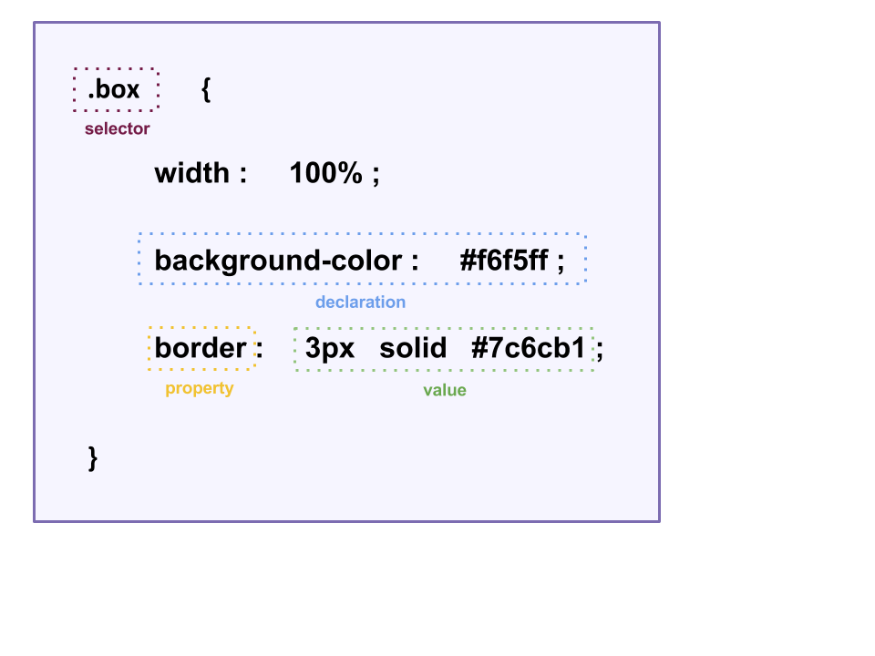

# CSS Selectors Overview

In order to apply styling to a webpage, we use CSS (Cascading Style Sheets) through a set of rules.

**CSS Rules** are composed of two parts: **1)** the specific styling using '*declaration(s)*' and **2)** where the styles should be applied using '*Selectors*.'

#### CSS Rule


### How to Select a CSS Selector
A CSS selector can be html elements or attributes.
When selecting html elements by their tag, simply set the selector to the tag name:
```
h1 {
    color: purple;
}
```
When using a class selector, a dot '.' is used prior to the class name:
```CSS
.name {
    color: purple;
}
```
ID selectors will have a hash '#' prior to the ID name:
```CSS
#name {
    color: purple;
}
```
Finally, you can select using any attribute using brackets '[]':
```
[href] {
    color: purple;
}
```
The same styles can be applied to multiple elements, by grouping the selectors together and simply placing a comma between them. In the above examples, the same style is being applied to each element. This can be repetitive and unnecessary and can be written as one rule:
```
h1, .name, #color, [href] {
    color: purple;
}
```

Finally, there are pseudo-class selectors, which is a keyword added to specify the state of the element when selected. Such as when the mouse hovers over an element. So in the following example we show that the anchor element font color will be blue, however, when the mouse hovers over the element, the color will change to green.
```
a {
    color: blue;
}
a:hover {
    color: green;
}
```
*Typically, it is better to use HEX or RGB color codes when picking a color value, however, for the purpose of explaining this concept, the examples have a color name as the value.*

### Specifying selectors
We'll use this block of code to show how to specfify selectors.

```
<section class='grocery'>
    <ul class='fruit'>
        <li id='strawberry'>Strawberries</li>
        <li>Apples</li>
            <ul class='appleType'>
                <li>Granny Smith</li>
                <li>Red Delicious</li>
                <li>Golden Delicious</li>
            </ul>
        <li>Oranges</li>
    </ul>
    <ul class='veges'>
        <li>Cucumber</li>
        <li>Tomato</li>
        <li>Broccoli</li>
    </ul>
</section>
```

* **Descendant Selectors** will apply style to an element that 'descends' from the selected element. This selection separates the ancestor element from its descendant element with a space.
  - **.grocery li** - Will select all list item elements *(li)* that are under the class of *grocery*.
* **Child elements** are selected with a right angle symbol **(>)**. These are direct descendants of a parent element.
  - **.grocery > ul** - This will select both the ul with the fruit and the class, but not the ul with the class of appleType since that is nested within the Apples list item and is not a direct descendant of grocery.
* **Pseudo-elements** are used to style parts of an element using two colons **(::)** between the element selected and it's pseudo-element.
  - **li::first-letter** - This will select all the first letters in each list item.

#### Selector Point System
CSS works with top bottom approach to styling, so that last style written is usually the style that will be applied. However, it's important to note when applying styles to elements, the most specific selector will override the selector that may be the same element that was trying to be styled, since CSS Selectors have a type of point system.
* 100 Points:
  - id name
* 10 Points:
  - class name
  - pseudo-class
  attributes
* 1 Points:
  - tag name
  - pseudo-elements
* 0 Points:
  - Combinators
    - space
    - \> (one level down)
    - ~ (sibling selectors)
  - "Universal" selector: *

So let's say we would like to style the list item with strawberry. We can select the item in multiple ways:
```
#strawberry {
    color: red;
}
.fruit:first-child {
    color: pink;
}
```
Since id is the most specific selector, it overrides the style written afterward. The #strawberry selector is worth 100 points, while the .fruit:first-child selector is worth 20 points.


*Information on CSS Selectors found from:  https://developer.mozilla.org/en-US/docs/Web/Guide/CSS/Getting_started/Selectors*
